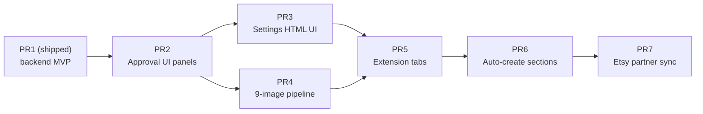

# OPERATIONAL INTEGRATION — Follow-up Roadmap
## PRs 2–7 after the Backend MVP (PR 1) landed

> **Status of PR 1 (already merged / on disk):** Sections B (models + seed + JSON settings API), C (VariationMatrixBuilder), D (DescriptionEngine), E (PersonalizationPicker), F (title adjective ladder), H (ListingBuilder orchestrator + `/listings/build`), K (EtsyListingPayloadBuilder + publisher patch + `EtsyClient.update_inventory`). Migration `c8d1a4e6b2f0`. Full test coverage under `backend/tests/test_modules/` and `backend/tests/test_db/`.
>
> **What this doc covers:** the deferred work — Sections G (9-image pipeline), I (Chrome extension tabs), J (approval UI panels), the HTML/Jinja Settings UI on top of the existing JSON API, and a couple of small quality-of-life items.
>
> **How to use this doc:** each PR section is self-contained. Hand a single PR section to an LLM and it should have enough context (file paths, symbol names, integration points) to implement it without re-reading OPERATIONAL_INTEGRATION.md end-to-end. Where useful, the PR references the specific existing symbol it should integrate with.

---

## Design principles (carry-overs from PR 1)

1. **Additive only.** No existing route, template, or DB column changes semantics. Every new feature sits behind either (a) a new route, (b) a `ShopSettings` toggle, or (c) a conditional branch keyed on `product.variation_preset_id is not None`.
2. **Reuse the singletons.** `ShopSettings.id=1` and `PricingStrategy.id=1` are the two singleton rows — always access via `session.query(...).filter_by(id=1).first()`.
3. **Mock-based tests.** Postgres JSONB rules out SQLite in-memory. All new tests should follow the pattern in `backend/tests/test_modules/test_payload_builder.py` (MagicMock session with `query.side_effect` dispatching by model class).
4. **Test file locations:** unit tests → `backend/tests/test_modules/`, DB/seed tests → `backend/tests/test_db/`.

---

## Dependency graph



Recommended order: PR 2 → PR 3 in parallel with PR 4 → PR 5 → PR 6 → PR 7.

---

## PR 2 — Approval UI extensions (Section J of source doc)

**Why first:** PR 1 produces variations and payloads that no human can currently inspect through the UI. This PR unlocks that.

### Scope
Add three panels to the existing approval detail page:
1. **Variation Matrix Preview** — table of Finish × Length (or Finish × MultiCount) cells, prices in dollars, loss-leader marker.
2. **Description Preview** — inline-editable description textarea per variant (autosave via the existing `PATCH /approval/{sku}/variant/{id}` route).
3. **Etsy Payload Preview** — collapsible `<details>` block showing the exact JSON that will be sent to Etsy.

### File-level plan
| File | Change |
|------|--------|
| [backend/src/web/templates/approval/detail.html](backend/src/web/templates/approval/detail.html) | Add 3 new `<section>` blocks below each `.variant-card`. Bootstrap-style classes to match existing markup. |
| [backend/src/web/routes/approval.py](backend/src/web/routes/approval.py) | Add `GET /approval/{sku}/payload-preview` returning `EtsyListingPayloadBuilder(session).build(product, chosen_variant).` Return `JSONResponse` with `default=str` for Decimal/datetime. |
| [backend/src/web/routes/approval.py](backend/src/web/routes/approval.py) | Pre-fetch `VariationRow` rows in `approval_detail` and pass to template as `variations` list. |
| [backend/src/modules/approval/service.py](backend/src/modules/approval/service.py) | Small helper `get_variation_matrix(session, product_id) -> list[dict]` that flattens rows for template rendering. |

### Template snippet (target shape)

```html

<section class="variation-matrix mt-4">
  <h5>Variation Matrix ({{ product.variation_preset_name }})</h5>
  <table class="table table-sm">
    <thead>...</thead>
    <tbody>
      
      <tr>
        <td>{{ row.finish }}</td>
        <td>{{ row.length_inches or '—' }}</td>
        <td>${{ '%.2f' | format(row.price_cents / 100.0) }}</td>
        <td>◉ loss leader</td>
      </tr>
      
    </tbody>
  </table>
</section>


<details class="payload-preview mt-3">
  <summary>Etsy payload preview</summary>
  <pre id="payload-json-{{ variant.id }}">Loading…</pre>
</details>
```

Payload preview is lazy-loaded via `fetch('/approval/{sku}/payload-preview?variant_id=A')` on first `<details>` expand.

### Tests
- `backend/tests/test_routes/test_approval_payload_preview.py` — new file. Uses `fastapi.testclient.TestClient` + MagicMock session; asserts JSON shape has `title`, `inventory.products`, `production_partner_ids`.

### Acceptance
- [ ] Approval detail page renders the matrix table when `product.variation_preset_id is not None`
- [ ] Loss-leader row visually distinguished (color or badge)
- [ ] Payload preview `<details>` returns valid JSON that byte-matches what `publisher.create_listing` will actually send (verify by capturing `client.post` call args in a mock)
- [ ] Legacy products (`variation_preset_id IS NULL`) show the old detail page unchanged

### Estimated size
~250 LOC (mostly template).

---

## PR 3 — Settings HTML UI (Section B.3 of source doc)

**Why:** the JSON API from PR 1 works but is unusable for non-devs. This puts a friendly editor on top.

### Scope
Single `/settings` page with 8 tabs, each POSTing to its existing `POST /settings/{tab}` endpoint.

Design-question default from Section O.6 of source doc: **wizard on first-time setup, tabbed editor afterwards.** For this PR, ship only the tabbed editor — the wizard is a nice-to-have and can be a separate PR (or scrapped if users self-serve fine).

### File-level plan
| File | Change |
|------|--------|
| `backend/src/web/routes/settings.py` | Add `set_templates(t)` (mirror pattern from other routes), plus `GET /settings` returning `settings/index.html`. |
| `backend/src/web/templates/settings/index.html` (new) | Tabbed layout — Bootstrap nav-tabs. |
| `backend/src/web/templates/settings/_partial_*.html` (new, 8 files) | One per tab: `_production_partner.html`, `_description_templates.html`, `_default_attributes.html`, `_variation_presets.html`, `_pricing_strategy.html`, `_personalization_library.html`, `_operations.html`, `_shop_sections.html`. |
| `backend/src/web/static/settings.js` (new) | Small vanilla-JS module: form serialize → JSON → `fetch(POST)` → toast on success. |
| [backend/src/main.py](backend/src/main.py) | Add `settings_routes.set_templates(templates)` next to the other `set_templates` calls. |

### Live pricing-matrix preview
The pricing tab should show a live-computed 3×7 matrix as the user edits offsets. Port `VariationMatrixBuilder._compute_price` to JS:

```javascript
// backend/src/web/static/settings_pricing_preview.js
function computeCell(cost, base_multiplier, finish_offsets, finish, length_base, per_inch_pct, length) {
  let price = cost * base_multiplier;
  price *= 1 + (finish_offsets[finish] ?? 0) / 100;
  if (length !== null) price *= 1 + (length - length_base) * per_inch_pct / 100;
  return Math.round(price);
}
```

Recomputes on every `input` event of the pricing fields. No server round-trip.

### Tests
- `backend/tests/test_routes/test_settings_ui.py` — new file. `TestClient` requests each `GET /settings` and asserts a 200 + presence of the tab nav.

### Acceptance
- [ ] `/settings` loads in under 500ms
- [ ] Saving one tab doesn't reload others
- [ ] Pricing preview recomputes without server call
- [ ] Every tab's save round-trips: reload → new values persisted

### Estimated size
~600 LOC (mostly Jinja templates).

---

## PR 4 — 9-image pipeline (Section G of source doc)

**Why:** meets the training's "3 mannequin + 3 concept + 3 chart" production standard. Currently listings ship whatever the legacy Phase 5 pipeline produces (typically 5–6 images).

### Scope
1. New workflow mode `"jewelry_9"` alongside the existing legacy workflow.
2. Deterministic chart generators (Pillow-based, template-driven).
3. Cover-photo auto-crop step.
4. Feature flag: `ShopSettings.image_workflow_mode` in {`"legacy"`, `"jewelry_9"`}.

### File-level plan
| File | Change |
|------|--------|
| `backend/src/db/models.py` | Add `ShopSettings.image_workflow_mode = Column(String(20), default="jewelry_9")`. |
| `backend/alembic/versions/<slug>_image_workflow_mode.py` (new) | One-column migration. |
| `backend/src/modules/images/jewelry_set.py` (new) | `@dataclass JewelryImageSet` with `mannequin_shots`, `concept_shots`, `birthstone_chart`, `size_chart`, `care_instructions_chart`, optional `gift_box_shot`. |
| `backend/src/modules/images/jewelry_set.py` | `async def generate_jewelry_set(product, workflow, session) -> JewelryImageSet`. Parallelises 3 mannequin + 3 concept generations via `asyncio.gather`. |
| `backend/src/modules/images/chart_generators.py` (new) | `BirthstoneChartGenerator`, `SizeChartGenerator(lengths_inches)`, `CareInstructionsChartGenerator`. |
| `backend/assets/charts/` (new) | Ship 3 template PNGs: `birthstone_chart_template.png`, `size_chart_template.png`, `care_instructions.png`. |
| `backend/assets/fonts/Inter-Medium.ttf` (new) | Font for the size-chart overlay. |
| `backend/src/modules/images/cover_crop.py` (new) | `auto_crop_cover_photo(image_path, output_path, target_aspect=(1,1), product_bbox=None) -> str`. Saliency fallback: centre-of-mass of non-background pixels. |
| [backend/src/modules/listings/orchestrator.py](backend/src/modules/listings/orchestrator.py) | Insert `Stage 0` before content gen: if `settings.image_workflow_mode == "jewelry_9"`, call `generate_jewelry_set` and persist `ProductImage` rows. Otherwise fall through to existing `run_image_pipeline`. |
| [backend/src/modules/etsy/payload_builder.py](backend/src/modules/etsy/payload_builder.py) | No change — images are uploaded by the publisher, not the payload builder. |
| [backend/src/modules/etsy/publisher.py](backend/src/modules/etsy/publisher.py) `upload_images` | Already rank-sorted; ensure ranks 1–9 are set correctly by the new pipeline. |

### Integration with the existing pipeline
The existing `run_image_pipeline` in [backend/src/modules/images/pipeline.py](backend/src/modules/images/pipeline.py) uses `ImageWorkflowFactory`. New code should:
- Reuse `AbstractImageGenerator` interface — mannequin + concept shots go through the existing Flux/Gemini/OpenAI generators via `ImageWorkflowFactory.get(workflow_name, settings)`.
- Charts are **not** AI-generated (deterministic Pillow output — see reasoning in Section G.2 of source doc).

### Rank ordering
Etsy uses rank to sort thumbnails. Enforce:
1. Rank 1: cover photo (best mannequin, auto-cropped)
2. Ranks 2–3: other mannequin shots
3. Ranks 4–6: concept shots
4. Rank 7: size chart
5. Rank 8: birthstone chart (only if `product.stone_shape` present or personalization has `has_birthstone`)
6. Rank 9: care instructions chart
7. Rank 10: optional gift-box shot

### Tests
- `backend/tests/test_modules/test_chart_generators.py` — chart generators produce byte-identical output across runs (compare SHA-256 of output PNGs).
- `backend/tests/test_modules/test_cover_crop.py` — synthetic 2000×2000 test image with a 400×400 black square at (500,500); assert crop centres on the square and target size is 2000×2000.
- `backend/tests/test_modules/test_jewelry_set.py` — MagicMock the `ImageWorkflowFactory.get(...)` so no real generator call, assert final set has 3 mannequin + 3 concept + 3 chart entries.

### Acceptance
- [ ] Full 9-image set generates in under 90 seconds on Flux workflow
- [ ] Charts are pixel-identical across runs (SHA hash test passes)
- [ ] Cover photo visibly improves thumbnail readability on a phone
- [ ] Legacy workflow (`image_workflow_mode="legacy"`) still runs unchanged for existing products

### Estimated size
~500 LOC + 3 PNG template assets + 1 font file.

### Open decisions this PR must resolve
- **Template PNG design.** Someone needs to design the 3 chart templates before this PR merges. Suggest: match the shop's brand palette; use Pillow-friendly transparent regions where the `SizeChartGenerator` overlays text.
- **Cover-photo bbox source.** Best-effort options: (a) rembg mask centre-of-mass (already in deps for background removal), (b) trust the first Flux generation's centre. Ship with (a) as default.

---

## PR 5 — Chrome extension Listing Builder + Title Helper tabs (Section I of source doc)

**Why:** delivers the "3–5 minute per product" UX that the training targets. Currently the only way to build is a curl POST to `/listings/build`.

### Scope
Two new tabs in the popup, alongside existing Phase 1 / Phase 2 / Sourcing tabs.

### File-level plan
| File | Change |
|------|--------|
| [etsy-chrome-extension/popup.html](etsy-chrome-extension/popup.html) | Add `Listing Builder` and `Title Helper` tab buttons + panels. |
| `etsy-chrome-extension/popup/listing_builder.js` (new) | Form → `POST /listings/build` → poll `/listings/{sku}/status` → open approval page. |
| `etsy-chrome-extension/popup/title_helper.js` (new) | Search box → `POST /research/quick-scrape` → render filtered results with "Copy Title" / "Use for Build" buttons. |
| [etsy-chrome-extension/popup.js](etsy-chrome-extension/popup.js) | Tab switcher (add cases for the 2 new tabs). |
| [etsy-chrome-extension/manifest.json](etsy-chrome-extension/manifest.json) | Ensure `storage` and `activeTab` permissions are declared. Verify `host_permissions` includes `rexven.com` and the local backend URL. |
| `backend/src/web/routes/research.py` (existing) | Add `POST /research/quick-scrape` — lightweight scrape (top-20, no persistence, no analyzers). Reuses `MiniPhase1Runner._scrape_keyword` logic without the DB writes. |

### Listing Builder tab (form)
Fields (all with sensible defaults auto-detected from the current Rexven page where possible):
- Carrier pillar (dropdown from `ShopSettings.active_pillars`)
- Material type (Brass / 925 Silver / Gold Plated)
- Personalization choice (dropdown from `PersonalizationPicker.USER_FACING_OPTIONS`)
- Stone shape (optional, dropdown)
- Target keyword (optional text — populated by "Use for Build" from Title Helper)
- Override base price (optional, in dollars)

### Title Helper tab
```
[search input]  [Search]
[✓] Hide "Ad by" listings
[✓] Star Sellers only
[ ] Bestsellers only

Results:
  ⭐ [title] [shop] [reviews] [price]     [Copy] [Use for Build]
  ⭐ ...
```

"Use for Build" writes the selected title to `chrome.storage.local.candidate_title` and switches to the Listing Builder tab which auto-fills the target keyword field.

### The `/research/quick-scrape` endpoint (new)
```python
@router.post("/research/quick-scrape")
async def quick_scrape(payload: QuickScrapeRequest) -> dict:
    """Lightweight top-20 scrape — no DB writes, no analyzers.
    Used by the Title Helper extension tab."""
    # Reuse the parsing helpers from src/sourcing/mini_phase1.py:
    # _parse_next_data, _card_to_listing (but skip .session.add())
    # Return: {"listings": [dict, dict, ...]}
```

The parsing helpers currently live as instance methods on `MiniPhase1Runner` — extract them to module-level pure functions (small refactor), then both `MiniPhase1Runner` and the new endpoint can share them.

### Tests
- `backend/tests/test_routes/test_quick_scrape.py` — happy path with mocked httpx response, assert 20 listings returned.
- Extension has no test framework currently — manual QA.

### Acceptance
- [ ] Listing Builder detects Rexven page and pre-fills form
- [ ] Title Helper returns filtered results within 8 seconds
- [ ] "Copy Title" copies to clipboard
- [ ] "Use for Build" persists candidate title across tab switch
- [ ] `/listings/build` receives the `target_keyword` from Title Helper

### Estimated size
~400 LOC (JS) + ~80 LOC (backend route).

---

## PR 6 — Auto-create shop sections on first Build (Section O.1 default)

**Why:** removes friction — user builds a Birthstone listing and the "Birthstone Necklace" section magically appears.

### Scope
Small quality-of-life patch to `ListingBuilder.build`.

### File-level plan
| File | Change |
|------|--------|
| `backend/src/db/models.py` | Add `ShopSettings.auto_create_sections = Column(Boolean, default=True)`. |
| `backend/alembic/versions/<slug>_auto_create_sections.py` (new) | One-column migration. |
| [backend/src/modules/listings/orchestrator.py](backend/src/modules/listings/orchestrator.py) | In `ListingBuilder.build`, after Product is committed, check for a matching `ShopSection` by `carrier_pillar`. If missing and `settings.auto_create_sections`, insert a new row with `display_order = max(existing) + 1` and a name derived from the pillar (e.g. "Birthstone Necklace"). |
| `backend/src/web/routes/settings.py` | Add `auto_create_sections` to `OperationsPatch` and `_OPERATIONS_FIELDS`. |

### Naming heuristic
```python
_PILLAR_TO_SECTION_NAME = {
    "cross": "Cross Necklace",
    "name": "Name Necklace",
    "birthstone": "Birthstone Necklace",
    "birth_flower": "Birth Flower Necklace",
    "pet": "Pet Memorial Jewelry",
    "pendant": "Pendant Necklace",
}
```

### Tests
- `backend/tests/test_modules/test_orchestrator_auto_sections.py` — MagicMock session, assert `session.add(ShopSection(...))` called with correct name when section absent; not called when section exists; not called when `auto_create_sections=False`.

### Acceptance
- [ ] Building for a new pillar auto-creates a `ShopSection` row
- [ ] Second build for same pillar does NOT duplicate
- [ ] Setting `auto_create_sections=False` in `/settings/operations` disables the behavior
- [ ] `etsy_section_id` stays NULL — Etsy-side sync is PR 7

### Estimated size
~50 LOC.

---

## PR 7 — Real Etsy production-partner + section sync (blocked)

**Status:** blocked on Etsy API. As of Open API v3, there is no public `POST /production_partners` endpoint. Shop sections do have a public `POST /application/shops/{shop_id}/sections` endpoint.

### What's implementable today
- **Sections sync.** Extend `POST /settings/production-partner/sync` (repurpose the endpoint name or add a new `POST /settings/shop-sections/sync`) to iterate over local `ShopSection` rows with `etsy_section_id IS NULL`, call `client.post("/application/shops/{shop_id}/sections", json={"title": section.name})`, and store the returned `shop_section_id`.

### What's blocked
- **Production partner creation.** Keep the stub in `POST /settings/production-partner/sync` returning `{"status": "manual_setup_required"}` and a link to the Etsy admin UI where the user creates the partner by hand and pastes the ID back into the settings form.

### File-level plan (sections sync only)
| File | Change |
|------|--------|
| [backend/src/modules/etsy/client.py](backend/src/modules/etsy/client.py) | Add `EtsyClient.create_shop_section(title: str) -> dict`. |
| `backend/src/web/routes/settings.py` | Add `POST /settings/shop-sections/sync` that iterates unsynced rows. |

### Tests
- `backend/tests/test_modules/test_shop_sections_sync.py` — MagicMock EtsyClient, assert one `create_shop_section` call per unsynced row.

### Acceptance
- [ ] Sections created locally show up on Etsy
- [ ] Re-running sync is idempotent (skips rows with `etsy_section_id` set)

### Estimated size
~80 LOC.

---

## Appendix — Symbols and files carried over from PR 1

For quick reference when writing the PRs above, here are the key symbols the follow-up work integrates with:

| Symbol / file | Purpose |
|---|---|
| [backend/src/db/models.py](backend/src/db/models.py) `ShopSettings`, `PricingStrategy` (singletons id=1) | Global config |
| `VariationPreset`, `VariationRow`, `PersonalizationTemplate`, `DescriptionTemplate`, `DefaultAttributes`, `ShopSection` | Per-category / per-listing config |
| [backend/src/db/seed_shop_defaults.py](backend/src/db/seed_shop_defaults.py) `seed_all(session)` | Idempotent seed hook (auto-runs on startup via `lifespan`) |
| [backend/src/modules/listings/variation_builder.py](backend/src/modules/listings/variation_builder.py) `VariationMatrixBuilder` | Matrix builder |
| [backend/src/modules/listings/description_engine.py](backend/src/modules/listings/description_engine.py) `DescriptionEngine.fill` | Description scaffold filler |
| [backend/src/modules/listings/personalization_picker.py](backend/src/modules/listings/personalization_picker.py) `PersonalizationPicker.USER_FACING_OPTIONS` | User-label to template mapping |
| [backend/src/modules/listings/orchestrator.py](backend/src/modules/listings/orchestrator.py) `ListingBuilder`, `ListingBuildRequest`, `run_listing_content_pipeline` | Per-product build entry point |
| [backend/src/modules/etsy/payload_builder.py](backend/src/modules/etsy/payload_builder.py) `EtsyListingPayloadBuilder.build` | Etsy v3 payload assembler |
| [backend/src/modules/etsy/client.py](backend/src/modules/etsy/client.py) `EtsyClient.update_inventory` | Variation inventory PUT |
| [backend/src/web/routes/listings.py](backend/src/web/routes/listings.py) | `POST /listings/build`, `GET /listings/{sku}/status`, `GET /listings/{sku}/variations` |
| [backend/src/web/routes/settings.py](backend/src/web/routes/settings.py) | 8-tab JSON API |
| [backend/src/config/prompts.py](backend/src/config/prompts.py) `JEWELRY_ADJECTIVE_LADDER` | Section F ladder |

## Appendix — Test conventions

- Location: `backend/tests/test_modules/` (module tests), `backend/tests/test_db/` (DB / seed tests), `backend/tests/test_routes/` (FastAPI route tests — create this folder in PR 2).
- No live DB. Use `MagicMock` with `query.side_effect = _dispatch_by_model` pattern (see [backend/tests/test_modules/test_payload_builder.py](backend/tests/test_modules/test_payload_builder.py)).
- Route tests use `fastapi.testclient.TestClient` with the same MagicMock session, injected via `app.dependency_overrides[get_session] = lambda: mock_session`.
- Run: `pytest tests/ -v` from `backend/` with the venv active.
